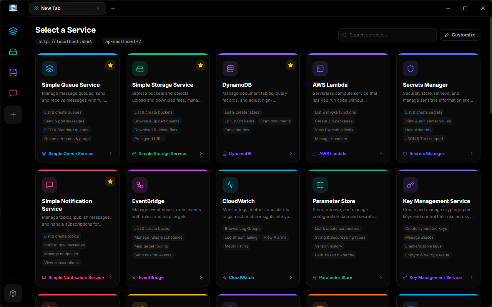

# StackView

[](https://github.com/NelushaUdaraka/stackview/releases/latest)
[](https://github.com/NelushaUdaraka/stackview/releases/latest)
[](LICENSE)

A desktop GUI for exploring and managing [LocalStack](https://localstack.cloud/) AWS services — browse resources, trigger actions, and inspect state without leaving your machine.

---

## Screenshot



---

## Features

- Browse and manage 32 AWS services running on LocalStack
- Dark and light themes with instant switching
- Per-region configuration saved across sessions
- Automatic updates — notified in-app when a new version is available
- Per-user Windows installer with no admin rights required

---

## Supported Services

| Compute & Serverless | Storage | Messaging |
|---|---|---|
| Lambda | S3 | SQS |
| EC2 | S3 Control | SNS |
| | DynamoDB | EventBridge |
| | Redshift | Kinesis |
| | OpenSearch | Firehose |

| Security & Identity | Networking | Management |
|---|---|---|
| IAM | API Gateway | CloudWatch |
| STS | Route 53 | CloudFormation |
| KMS | R53 Resolver | Parameter Store |
| Secrets Manager | Certificate Manager | Config |
| | | Resource Groups |

| Communication & Workflow | |
|---|---|
| SES | SWF |
| Transcribe | Step Functions (SFN) |
| Scheduler | Support |

---

## Prerequisites

- [LocalStack](https://localstack.cloud/) running at `http://localhost:4566`
- Windows 10 or 11 (x64)

### Starting LocalStack

```bash
# Using Docker
docker run --rm -it -p 4566:4566 localstack/localstack

# Or using the LocalStack CLI
localstack start
```

---

## Installation

Download the latest `StackView-Setup-*.exe` from the [Releases](https://github.com/NelushaUdaraka/stackview/releases/latest) page and run the installer. No admin rights required — installs per-user.

---

## Auto-Update

StackView checks for updates automatically on startup. When a new version is available:

1. A download starts silently in the background
2. The **Settings** menu shows the download progress
3. Once ready, an **Install & Restart** button appears — click it to apply the update

You can also disable auto-update or trigger a manual check from the Settings menu in the nav rail or the connection screen.

---

## Known Limitations

- **Windows only** — macOS and Linux builds are not available yet
- **LocalStack Community** — tested against LocalStack Community Edition. Some services may require LocalStack Pro
- **No real AWS** — the app connects only to `http://localhost:4566`; it cannot connect to real AWS endpoints
- **Credentials** — LocalStack accepts any credentials; the app uses `test / test` internally
- **Regions** — all standard AWS region identifiers are accepted, but LocalStack may not emulate every region-specific behaviour

---

## Development

```bash
# Clone
git clone https://github.com/NelushaUdaraka/stackview.git
cd stackview

# Install dependencies
npm install

# Start dev server (Electron + Vite HMR)
npm run dev

# Type-check
npx tsc --noEmit

# Build installer locally (output in /dist)
npm run dist
```

---

## Contributing

Contributions are welcome. Please open an issue first to discuss what you'd like to change.

---

## Tech Stack

| Layer | Technology |
|-------|------------|
| Shell | Electron 31 |
| UI | React 18 + TypeScript |
| Build | electron-vite + Vite |
| Styling | Tailwind CSS |
| Packaging | electron-builder (NSIS) |
| Updates | electron-updater |
| AWS SDK | AWS SDK for JavaScript v3 |

---

## License

[MIT](LICENSE)
